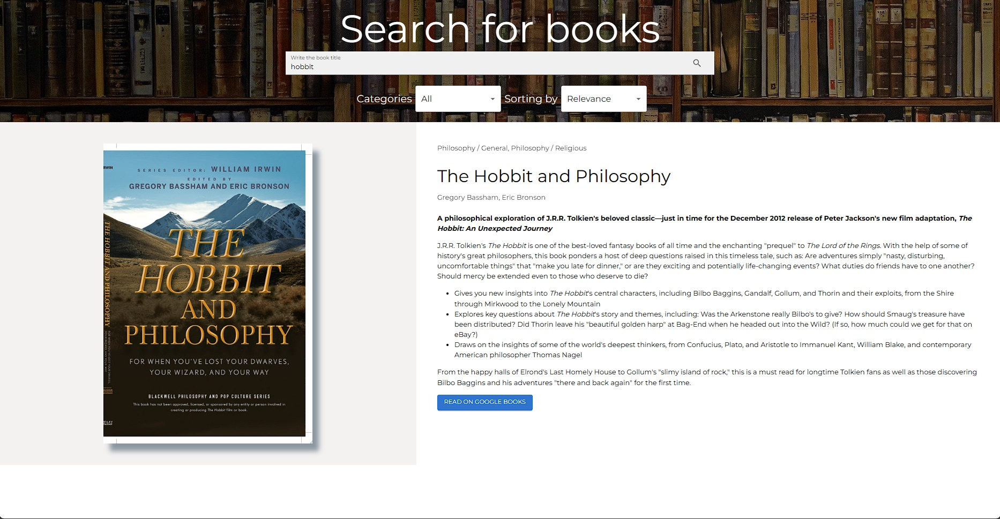

## Техническое Задание

Необходимо разработать React-приложение поиска книг с помощью Google Books API. Документация: https://developers.google.com/books/docs/v1/using. Для авторизации запросов к API выбрать способ с предоставлением API key (https://developers.google.com/books/docs/v1/using#APIKey).

Дополнительным плюсом будет: Финальный билд приложения должен быть запускаться из __Docker контейнера__ (хотябы с минимальной конфигурацией)

__Функционал__

- Должны быть текстовое поле и кнопка поиска. По введенной пользователем подстроке производится поиск книг. Триггером к поиску является либо нажатие Enter (когда текстовое поле в фокусе), либо нажатие кнопки поиска.
- Фильтрация по категориям. Ниже текстового поля располагается селект с категориями: all, art, biography, computers, history, medical, poetry. Если выбрано "all" (выбрано изначально), то поиск производится по всем категориям.
- Сортировка. Рядом с селектом категорий находится селект с вариантами сортировки: relevance (выбран изначально), newest.
- Найденные книги отображаются карточками, каждая из которых состоит из изображения обложки книги, названия книги, названия категории и имен авторов. Если для книги приходит несколько категорий, то отображается только первая. Авторы отображаются все. Если не приходит какой-либо части данных, то вместо нее просто пустое место.
- Над блоком с карточками отображается количество найденных по запросу книг.
- Пагинация реализована по принципу 'load more'. Ниже блока с карточками находится кнопка 'Load more', по клику на нее к уже загруженным книгам подгружаются еще. Шаг пагинации - 30.(Сделал 32 для красоты:))
- При клике на карточку происходит переход на детальную страницу книги, на которой выводятся ее данные: изображение обложки, название, все категории, все авторы, описание.

__Замечания__

- __Обязательно__ использование Redux/MobX.
- __Желательно__ Typescript
- Во время загрузки книг стоит показать какой-то индикатор
- Использование сторонних библиотек будет плюсом только в случае если это оправданно и вы сможете объяснить причину выбора. Показав свои знания в грамотном применении сторонних готовых решений, вы имеете шанс повысить свою профессиональную привлекательность для нас.
- Пишите код так, как бы вы его писали в работе &mdash; внутренности задания будут оцениваться даже тщательней, чем внешнее соответствие заданию. Код должен быть организован так, чтобы его можно было заново использовать.
- Помните про обработку ошибок!
- Верстка может быть самая простая, однако она не должна ломаться при разрешениях от 320px до 1920px. Визуализацию и украшение делайте на ваш вкус. Мы не против использования [Bootstrap](http://getbootstrap.com/) или похожего UI фреймворк, но только для UI представления (нельзя использовать JS код для решения задачи, но можно использовать для оформительских эффектов (анимации и тому подобное))!

## Разворачивание
1. Склонировать репозиторий
2. Выполнить `npm install`в консоли в корневой директории репозитория
3. Стартовать проект с помощью `npm start`

## Разработка
Было решено использовать три библиотеки для этого проекта.

**Material UI** - готовые компоненты Material UI хорошо документированы и просты в использовании. Это позволяет быстро создавать приложения с современным и привлекательным дизайном. Не нужно тратить много времени на стилизацию и верстку элементов. Также, удобно создавать адаптив под все устройства.

**React Router DOM** - библиотека для навигации в приложениях React.

**Axios** - для удобных запросов на сервер, библиотека имеет интуитивно понятный API для выполнения HTTP-запросов. Также, Axios автоматически преобразует ответы сервера в формат JSON. Нет необходимости делать это вручную.

В качестве стейт менеджера было решено использовать Redux Toolkit. Предсказуемая структура кода и удобство отладки выделяет его в сравнении с MobX.

## Внешний вид

Основная страница поиска

Страница конкретной книги

## Тестирование
Чтобы убедиться в корректной работе сайта, я использую следующие методы тестирования:
- Ручное тестирование - проверка всех страниц и функционала вручную, имитация действий пользователя. Это позволяет выявить ошибки в работе элементов сайта, проблемы с отображением на разных устройствах и браузерах.
- Тестирование юзабилити - провожу юзабилити-тестирование с привлечением реальных пользователей, чтобы понять, насколько сайт интуитивно понятен.
- Юнит тестирование - unit тесты, не проводил, так как не так давно познакомился с Jest и пока не применял их в реальном проекте.

